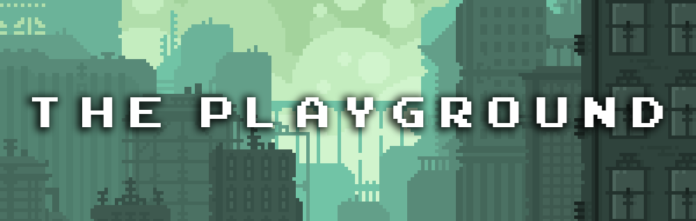

  

 
 
The playground is a group of Software Engineering, Cloud Engineering, and DevSecOps Engineering projects. 

I wanted to a place where I can build, provision, and experiment with different technologies.

**This is why I created this project**.

[Projects](#projects) •
[Key Features](#key-features) •
[How to make use of the playground](#how-to-make-use-of-the-playground) •
[Technologies Used](#technologies-used)

## Projects

<b>Projects 001 - Powershell</b>

1. ``Powershell 001 - Snippets`` : is an a collection of Powershell snippets.

<b>Projects 002 - CSS </b>

1. ``CSS 001 - Snippets`` : is an a collection of CSS snippets.

<b>Projects 005 - Flask</b>

1. ``Flask 001 - Snippets`` : is an a collection of flask snippets.

<b>Projects 008 - Docker</b>

1. ``Docker 001 - Snippets`` : is an a collection of docker snippets.
2. ``Docker 002 - Jenkins Installer`` : is a docker-compose file, built to boot jenkins instance in the cloud.

<b>Projects 009 - Ansible</b>

1. ``Ansible 001 - Snippets`` : is an a collection of ansible snippets.
2. ``Ansible 002 - Docker Installer`` : is an ansible playbook, built to install docker across multiple numbers of virtual machine in the cloud.

## Key Features

- The playground has a wide range of projects in multiple technologies in multiple disciplines
- It has at least 10 projects in each technology
- You can use these projects in your learning process
- You can rebuild the idea from scratch with your improvements as resumer project

## How to make use of the playground

1. Read the project description and try recreating it from scratch
2. Compare your code with the playground code.
3. Watch the videos embedded in each project which shows how to build it in a step by step manner 
4. Contact me if you have any questions

## Technologies Used

This is the list of technologies used in the playground

| Application                                         | Description                                  
| --------------------------------------------------- |--------------------------------------------- 
| [YAML](https://yaml.org/)                           | A Human-readable data-serialization language                 
[Docker](https://www.docker.com/)                           | A set of platform as a service products that use OS-level virtualization to deliver software in packages called containers                 
| [Powershell](https://docs.microsoft.com/en-us/powershell/)                           | A task automation and configuration management program from Microsoft                 
| [Windows](https://www.microsoft.com/en-us/windows)                 | A group of several proprietary graphical operating system families developed and marketed by Microsoft  
| [CSS](https://www.w3.org/Style/CSS/Overview.en.html/)                           | A style sheet language used for describing the presentation of a document written in a markup language                 
| [HTML](https://developer.mozilla.org/en-US/docs/Web/HTML)                 | A  markup language for documents designed to be displayed in a web browser   
| [Ansible](https://www.ansible.com/)                 | A software provisioning, configuration management, and application deployment tool        
| [Python](https://www.python.org/)                   | A programming language that lets you work quickly and integrate systems more effectively.         
| [Flask](https://flask.palletsprojects.com/en/2.1.x/)                           | A popular, extensible web microframework for building web applications with Python.                              
| [Markdown Guide](https://www.markdownguide.org/)    | A reference guide that explains how to use markdown                                 
