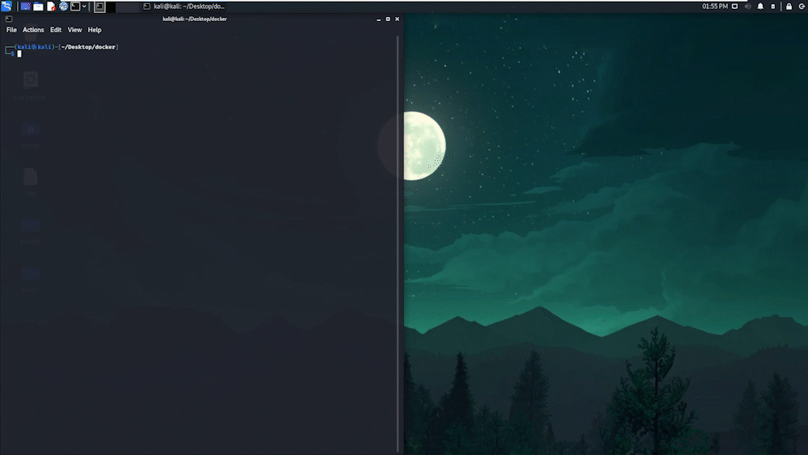

<div align="center">

<p align="center">
  
</p>


<br />
<br />
Ansible Installer is a docker-compose file, built to boot jenkins instance in the cloud.

I wanted to deploy a jenkins instance. My only problem was that I wanted to boot it as a container with multiple other containers so I used docker compose file

**This is why I created this project**.

[Key Features](#key-features) •
[Installation](#installation) •
[Technologies Used](#technologies-used) •
[Contact Me](#contact-me) 





</div>

## Key Features

- Ability to create jenkins instance to creat a ci/cd pipeline.
- It can work with both on-prem and in the cloud (AWS, Azure, GCP...etc) 
- It has the ability to boot multiple other containers with a single command
- It can be ran multiple times with ease (IaC)

## Installation

### *Step 1: Run Docker Compose*

Run the following command in command line but make sure to 

- Change the ``<docker-compose file>`` to the name of docker compose file which is in our case is ``jenkins.yml``

```
sudo docker-compose -f <docker-compose file> up
```

### *Step 2: Open Web Browser*

Open the web broswer and go to the following link ``http://localhost:8080`` and you will get the jenkins instance


### *Step 3: Add Multiple containers*

You can modify the docker compose file to add multiple other containers in the same network for the ci/cd pipeline 


## Technologies Used

| Application                                         | Description                                  
| --------------------------------------------------- |--------------------------------------------- 
| [Docker](https://www.docker.com/)                           | A set of platform as a service products that use OS-level virtualization to deliver software in packages called containers                 
| [YAML](https://yaml.org/)                | A Human-readable data-serialization language   
| [Markdown Guide](https://www.markdownguide.org/)    | A reference guide that explains how to use markdown                                        

## Contact Me
<p align="center">
<a href="https://www.linkedin.com/in/iamnasef/"></a>
<a href="https://twitter.com/iamnasef"></a>
<a href="https://github.com/iamnasef"></a>
<a href="https://www.youtube.com/channel/UCx2qgl5gjP_oSK_mz674EtA"></a>
</p>