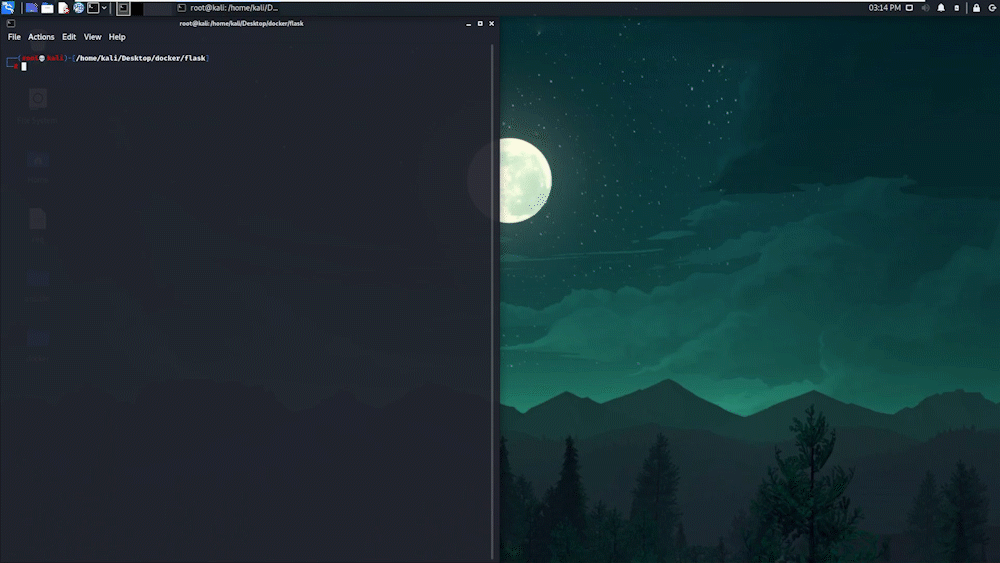

  

 
 
Containarized Flask is a Docker Image, built to make a containarized version of a flask api application.

I wanted to create a CI/CD pipeline for a flask api application. My only problem was that containarizing an application and creating a DockerImage from it is an essential part in this process.

**This is why I created this project**.

[Key Features](#key-features) •
[Installation](#installation) •
[Technologies Used](#technologies-used) •
[Contact Me](#contact-me) 

## Key Features

- 

## Installation

## Technologies Used

| Application                                         | Description                                  
| --------------------------------------------------- |--------------------------------------------- 
| [Docker](https://www.docker.com/)                           | A set of platform as a service products that use OS-level virtualization to deliver software in packages called containers                 
| [YAML](https://yaml.org/)                | A Human-readable data-serialization language  
| [Python](https://www.python.org/)                           | A programming language that lets you work quickly and integrate systems more effectively.         | 
[Flask](https://flask.palletsprojects.com/en/2.1.x/)                           | A popular, extensible web microframework for building web applications with Python.     
| [Markdown Guide](https://www.markdownguide.org/)    | A reference guide that explains how to use markdown                                        

## Contact Me

