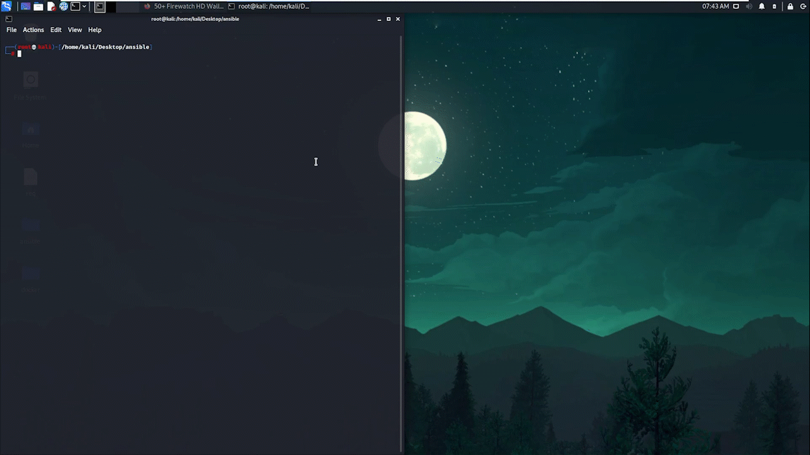

<div align="center">

<p align="center">
  
</p>


<br />
<br />
Ansible Snippets is an a collection of YAML scripts and Adhoc commands.

I wanted to deploy a docker swarm. My only problem was that all the available virtual machines doesn't have docker

**This is why I created this project**.

[Key Features](#key-features) •
[Installation](#installation) •
[Technologies Used](#technologies-used) •
[Contact Me](#contact-me) 





</div>

## Key Features

- Ability to execute command on hundreds of machine instances.
- It can work with both on-prem and in the cloud (AWS, Azure, GCP...etc) 
- It has the ability to install docker which is the most popular containerization and orchestration software

## Installation

### *Step 1: Install SSH Server*

Ansible relies on ssh protocol to execute commands accross all the notes. So First you need to have a running ssh server in all of the nodes. You can Install it on debian based distributions using the following commands

```
sudo apt-get update
sudo apt-get upgrade
sudo apt-get install openssh-server
sudo systemctl start ssh
```

### *Step 2: Modify the inventory*

Inventory is a configuration file which contains all the important information about the machines you want to configure. So make sure to modify ``inventory.ini`` as follows

- Change the ip address to match the ip address on all of your nodes
- Change the ansible_user variable to match the name of the user in your machine
- Change the ansible_password variable to match the name of the password in your machine

### *Step 3: Check if the network is working*

Run the following command to check if all the configuration is running good, But make sure to 

- Change the ``<host>`` to the name of the group you want to install docker onwhich is in our case is ``servers``
- Change the ``<inventory>`` to the name of inventory file which is in our case is ``inventory.ini``
  
```
ansible <host>-i <inventory> -m ping -K → check if servers are online
```

### *Step 4: Run the playbook*
Now run the playbook using the following command, But make sure to

- Provide sudo password when you are asked to
- Change the ``<inventory>`` to the name of inventory file which is in our case is ``inventory.ini``
- Change the ``<playbook>`` to the name of the playbook which is in our case is ``install_docker.yml``

```
ansible-playbook -i <inventory> <Playbook> -K 
```

## Technologies Used

| Application                                         | Description                                  
| --------------------------------------------------- |--------------------------------------------- 
| [YAML](https://yaml.org/)                           | A Human-readable data-serialization language                 
| [Ansible](https://www.ansible.com/)                 | A software provisioning, configuration management, and application deployment tool                                  
| [Markdown Guide](https://www.markdownguide.org/)    | A reference guide that explains how to use markdown                                 

## Contact Me
<p align="center">
<a href="https://www.linkedin.com/in/iamnasef/"></a>
<a href="https://twitter.com/iamnasef"></a>
<a href="https://github.com/iamnasef"></a>
<a href="https://www.youtube.com/channel/UCx2qgl5gjP_oSK_mz674EtA"></a>
</p>